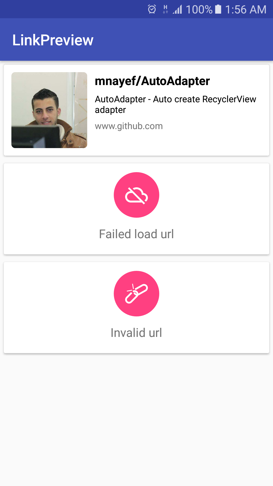

# LinkPreviewLibrary
A light-weight android library that can be quickly integrated into any app to use link preview.

# Example Uses
- To use link preview view.
- To make custom link preview view.

# Screenshot


# Example LinkPreviewView:

**XML**
```
<com.mnayef.library.view.LinkPreviewView
    android:id="@+id/link_preview"
    android:layout_width="match_parent"
    android:layout_height="wrap_content"
    app:failedLoadMsg="@string/failed_load_url"
    app:invalidLinkMsg="@string/invalid_url" />
```

**JAVA**
```
LinkPreviewView linkPreviewView = (LinkPreviewView) itemView.findViewById(R.id.link_preview);
linkPreviewView.load("https://www.github.com");
```

# Example custom request:

**JAVA**
```
new LinkPreviewTask(this, "https://www.github.com", new Callback() {
    @Override
    public void onSuccess(Link link) {
        // Use link object to get url data.
    }

    @Override
    public void onFailed() {
        // Handle network error
    }

    @Override
    public void onMalformedUrl() {
        // Handle malformed url 
    }
});
```

# How do I get set up? 

Project-level build.gradle \(\<project>/build.gradle):
```
allprojects {
    repositories {
        ...
        maven { url 'https://jitpack.io' }
    }
}
```

App-level build.gradle \(\<project>/\<app-module>/build.gradle):

```
compile 'com.github.mnayef:AndroidLinkPreview:v1.0.0'
```
